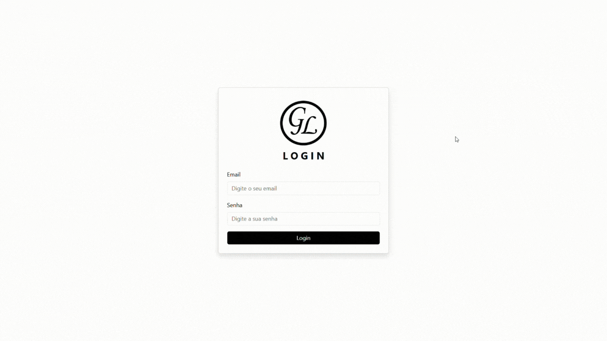

  <h1>Gerenciador de Licenças</h1>
  <code>Angular</code> <code>API</code> <code>C#</code> <code>Typescript</code> <code>MySQL</code> <code>Bootstrap</code> <code>Font Awesome</code>

 

  <h2>O que é o GL?</h2>

  <h2>Pastas e Arquivos</h2>
  <table>
    <thead>
      <tr>
        <th>Nome</th>
        <th>Função</th>
      </tr>
    </thead>
    <tbody>
      <tr>
        <td><code>API Employees</code></td>
        <td>É a API que desenvolvi usando C# no Visual Studio para interagir com o sistema entregando as informações do banco de dados.</td>
      </tr>
      <tr>
        <td>Projeto/<code>public</code></td>
        <td>Pasta de documentos públicos, visíveis para todos os usuários.</td>
      </tr>
      <tr>
        <td>Projeto/public/<code>api_employees.sql</code></td>
        <td>É a importação do banco de dados com os dados de teste.</td>
      </tr>
      <tr>
        <td>Projeto/<code>angular.json</code></td>
        <td>x</td>
      </tr>
      <tr>
        <td>Projeto/<code>src</code></td>
        <td>x</td>
      </tr>
      <tr>
        <td>Projeto/src/<code>index.html</code></td>
        <td>x</td>
      </tr>
      <tr>
        <td>Projeto/src/<code>index.html</code></td>
        <td>x</td>
      </tr>
      <tr>
        <td>Projeto/src/<code>main.ts</code></td>
        <td>x</td>
      </tr>
      <tr>
        <td>Projeto/src/<code>styles.css</code></td>
        <td>x</td>
      </tr>
      <tr>
        <td>x</td>
        <td>x</td>
      </tr>
      <tr>
        <td>x</td>
        <td>x</td>
      </tr>
      <tr>
        <td>x</td>
        <td>x</td>
      </tr>
      <tr>
        <td>x</td>
        <td>x</td>
      </tr>
      <tr>
        <td>x</td>
        <td>x</td>
      </tr>
      <tr>
        <td>x</td>
        <td>x</td>
      </tr>
      <tr>
        <td>x</td>
        <td>x</td>
      </tr>
    </tbody>
  </table>

  <h2>Comandos usados no VS Code</h2>

  <h2>Planejamentos futuros</h2>

- Responsividade.
- Adicionar a opção de selecionar o status do novo usuário a ser cadastrado entre Admin e Employee.
- Conter a quantidade de blocos nas tables.
- Investir em segurança.
- Criar a página de "Esqueci a minha senha".
- Cadastro de dados via importação.
- Adicionar biblioteca para os alerts.

